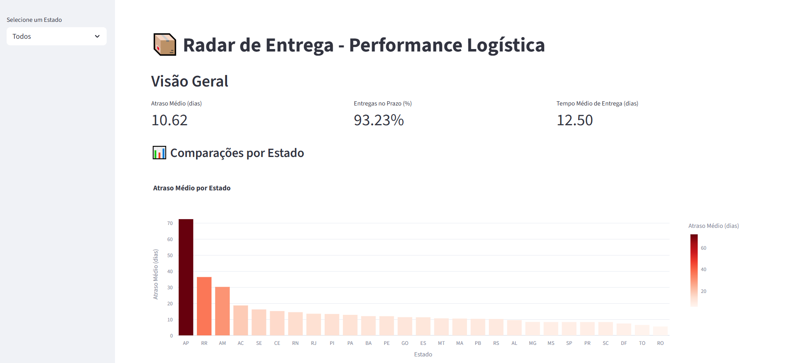
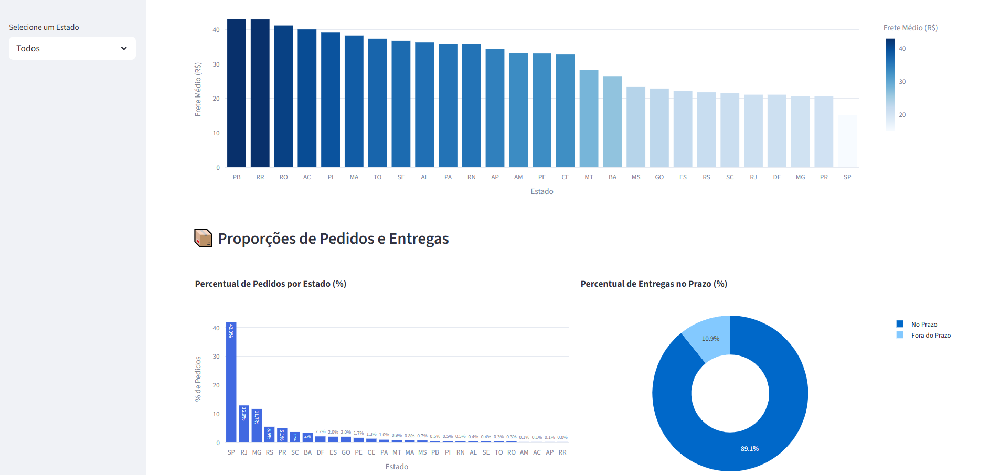
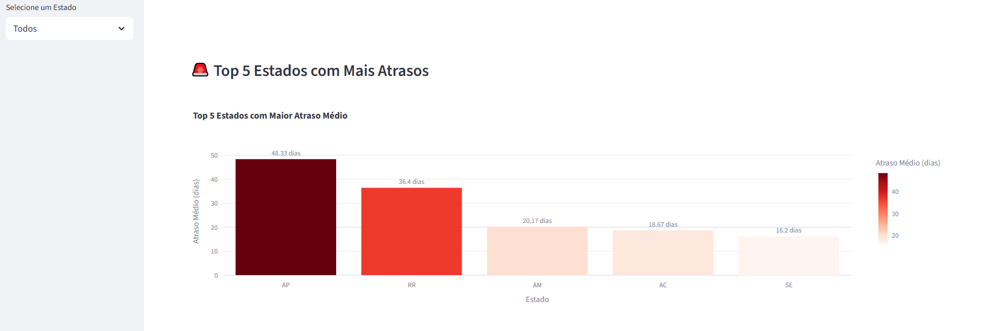
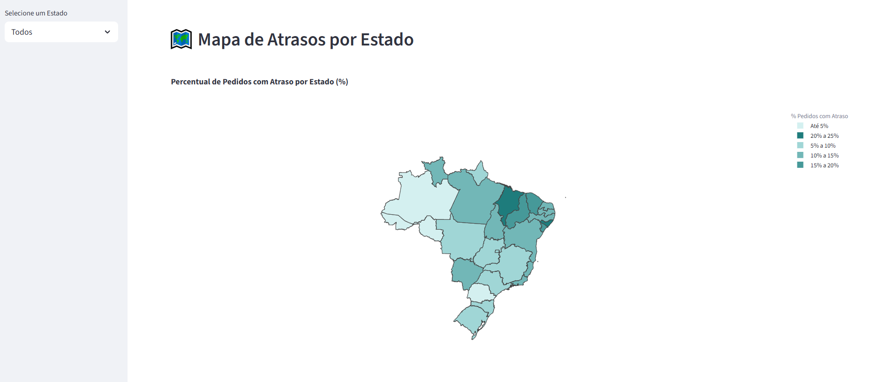

## Funcionalidades

- **Filtros dinâmicos**: seleção por estado e cidade
- **KPIs principais**: atraso médio, percentual de entregas no prazo, frete médio, etc.
- **Gráficos interativos**: barras, linhas, mapas geográficos, etc
- **Atualização em tempo real** a partir dos dados no banco


### Como executar localmente

```bash
streamlit run app.py
```